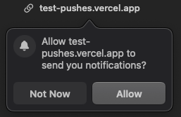
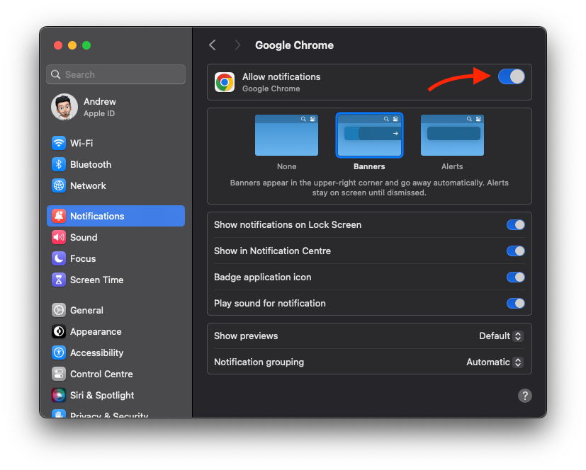
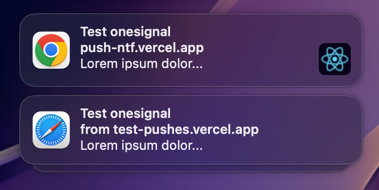

# Test web notifications & push notifications (OneSignal)
Desktop only*! `Chrome` `Firefox` `Safari` `Edge`

Mobile browsers do not support Web notifications only Push notifications.

Visit https://test-pushes.vercel.app/ and click on the button to subscribe to push notifications. You will receive a push notification after subscribing. You can also test web notifications by clicking on the button to show a notification.

### Allow Web notifications from site 
e.g. `Arc Browser` pop-up:

If you have **blocked** notifications, you can unblock them by clicking on the 🔒 icon in the address bar or check the **site settings** in the browser.

### Check global settings 

(e.g. OSX: System Preferences → 🔔 Notifications)

### Test Push notifications using OneSignal:

)

